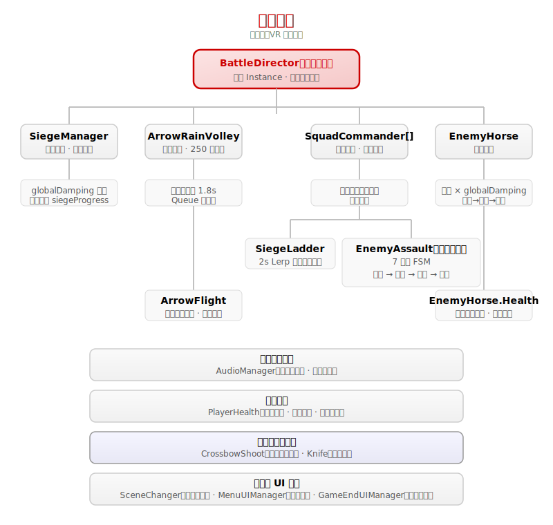

# 《孤城》(The Isolated Fortress) — 综合挑战实践课 II 期末大作业报告

**选题：基于具身交互的 VR 历史仿真体验**

> 班级：_____________  学号：_____________  姓名：_____________
> （组队：陈琦 2023212638、王新弈 2023217674）

---

## 摘要

《孤城》(The Isolated Fortress) 是一款基于 **PICO 3 (移动 VR)** 平台开发的 VR 历史仿真体验作品。项目取材自东汉永平十八年（公元 75 年）耿恭疏勒城保卫战——"十三人归玉门"的真实历史事件，旨在通过 **零摇杆位移、真实物理运动** 的具身交互方式，结合极简的 **黑白红水墨视觉风格（NPR 非真实感渲染）**，构建高压的攻城防御体验。

项目定位为一款以东汉历史为背景的 VR 体感交互系统，摒弃传统游戏的虚拟操控，以"无摇杆"战斗系统，让玩家身临其境，亲身诠释戍边将士的热血与忠诚。玩家化身耿恭驻守疏勒城，仅凭身体动作完成格挡、挥砍、射箭等攻防操作，在匈奴铁骑的围攻下，通过真实的肢体反馈，体验孤城绝境中步步惊心的生存与反击。

项目采用 **BattleDirector** 为总控核心的战斗指挥架构，集成了攻城梯方阵推进体系、箭雨物理系统（250 对象池 + 抛物线弹道）、骑兵冲锋体系、精英死士有限状态机以及大黄弩 VR 射击 + 近身搏斗等核心玩法系统。视觉上使用 URP 管线配合自研手写 HLSL Shader（InkCodeShader 水墨透明效果、FlagWind 旗帜飘动顶点动画）和 Shader Graph（SG_Terrain 地形混合、SG_PropOutline 法线描边），实现移动端高性能的水墨风格渲染。

项目已通过 PICO 3 真机验证，解决了 PICO SDK 3.4.0 → 3.1.0 降级的兼容性问题，APK 可正常运行。作品具备数字文旅、体感教育、爱国主义教育等多元价值延伸潜力。

**关键词**：VR 历史仿真；具身交互；水墨渲染；疏勒城；Unity；PICO

---

## 一、开发环境

### 1.1 硬件环境

| 项目 | 规格 |
|------|------|
| 开发 PC | Windows 10/11，Intel Core i7，16GB+ RAM |
| 目标 VR 设备 | PICO 3 一体机（移动 VR） |
| VR 交互方案 | 6DoF 空间定位 + 双手柄追踪 |

### 1.2 软件环境

| 项目 | 版本 / 名称 |
|------|-------------|
| 游戏引擎 | Unity 2022.3.62f3c1 |
| 渲染管线 | Universal Render Pipeline（URP） |
| VR 框架 | Unity XR Interaction Toolkit |
| PICO SDK | PICO Unity Integration SDK v3.1.0 |
| 编程语言 | C# |
| 3D 建模 | Blender |
| AI 寻路 | AI Navigation（NavMesh） |
| 视觉效果 | Shader Graph + HLSL Shader |
| 粒子/特效 | VFX Graph |
| 动画系统 | Unity Animator Controller + Animation Event |
| 版本控制 | Git |
| 录屏工具 | PICO 自带录屏 |

### 1.3 项目规模

| 项目 | 数据 |
|------|------|
| 核心脚本数量 | 25+ C# 脚本 |
| 场景总数 | 4（Boot → GameStartMenu → Scene2_city_v2 → GameEnd） |
| 自定义 Shader | 7+（手写 HLSL + Shader Graph） |
| 预制体 | 15+ |
| 开发周期 | ~9 周 |
| 核心开发团队 | 2 人 |

---

## 二、运行方法

### 2.1 运行前提

1. **Unity 编辑器运行**：需安装 Unity 2022.3.62f3c1，打开项目后确保已导入以下 Package：
   - Universal RP（URP）
   - XR Interaction Toolkit
   - PICO Unity Integration SDK v3.1.0
   - AI Navigation（NavMesh）
2. **PICO 真机运行**：需将项目打包为 Android APK，安装至 PICO 3 设备。打包前确认：
   - Build Settings → Platform 切换为 Android
   - Player Settings → Minimum API Level ≥ 29
   - XR Plug-in Management → 勾选 PICO
   - APP ID 已通过 PICO 开发者平台获取并配置

### 2.2 运行流程

整个体验由 4 个场景串联：


- **BootScene**：启动加载，存放全局 Don't Destroy On Load 管理器（如 AudioManager、SceneChanger），防止重复生成，由 BootLoader 自动跳转至主菜单
- **GameStartMenu**：主菜单场景，巨大标题营造宏伟感，3D UI 界面让玩家进入或退出
- **Scene2_city_v2**：核心战斗场景，玩家在城墙上面对大军，用弩箭射击防守、与冲上城墙的敌军厮杀
- **GameEnd**：结算场景，显示历史描述，加深玩家对历史印象；点击返回主菜单可重新开始战斗

### 2.3 操作说明

| 操作 | 手柄动作 | 效果 |
|------|---------|------|
| 大黄弩射击 | 扣动扳机键（Trigger） | 箭矢从弩口飞出，命中敌人触发压制效果 |
| 挥刀近战 | 拔刀迎击 | 死士翻墙后近身格斗，刀刃墨迹拖尾 |
| 躲避箭雨 | 真实下蹲 / 侧移 | 被敌箭命中会闪红 + 短暂僵直 |
| 暂停 | 按下手柄 Menu 键 | 呼出暂停菜单，射线点击 UI |

### 2.4 构建产物

打包后的 APK 文件可直接安装至 PICO 3 设备运行。如需在编辑器中测试，打开 `Scene2_city_v2` 场景后点击 Play，战斗将在 3 秒后自动开始。

---

## 三、制作步骤

### 3.1 行业之困与项目概述

#### 3.1.1 行业之困：VR 体验与文旅叙事的双重瓶颈

**VR 交互设计的三大极端：**

| 问题 | 描述 |
|------|------|
| ✗ 被动观看 | 传统 360° 全景视频让体验者沦为被动的摄像机，缺乏交互性，难以产生代入感 |
| ✗ 粗暴移植 | 直接将 PC 游戏的 UI 点击与摇杆移动移植到 VR，破坏沉浸感，极易产生眩晕 |
| ✗ 体感脱节 | 身体真实动作与虚拟反馈不一致，捕捉延迟或错位，让用户产生割裂感，体验不自然 |

**文旅与历史叙事的三大困境：**

| 困境 | 描述 |
|------|------|
| 遗址"沉默" | 静态遗址难以向游客讲述背后的英雄史诗，历史厚度被稀释 |
| 形式单一 | 传统展板和讲解词冲击力有限，难以形成深刻的记忆与情感共鸣 |
| 体验同质化 | 缺乏互动性与参与感，难以吸引年轻游客，文化吸引力不足 |

#### 3.1.2 项目概述：重塑历史的具身感

**项目定位：** 一款以东汉历史为背景的 VR 体感交互系统，摒弃传统游戏的虚拟操控，以"无摇杆"战斗系统，让玩家身临其境，亲身诠释戍边将士的热血与忠诚。

**核心玩法：** 玩家化身耿恭驻守疏勒城，仅凭身体动作完成格挡、挥砍、射箭等攻防操作。在匈奴铁骑的围攻下，通过真实的肢体反馈，体验孤城绝境中步步惊心的生存与反击。

**设计理念：** 以体感交互为核心，以英雄故事为魂，在绝境坚守中引发玩家对忠诚、勇气与希望的情感共鸣。

| 项目 | 内容 |
|------|------|
| 作品名称 | 《孤城》(The Isolated Fortress) |
| 开发团队 | 2 人 |
| 开发平台 | Unity 2022.3.62f3c1 + Blender + URP / PICO 3 |
| 视觉风格 | 极简黑白红水墨风格（NPR 渲染） |
| 核心愿景 | 零摇杆位移 + 真实体能消耗 → 高压极限防御场 |

#### 3.1.3 历史背景：疏勒孤城，十三人归玉门

公元 75 年 · 围城：
东汉重设西域都护府，耿恭出任戊己校尉，率部进驻金蒲城。北匈奴数万大军围疏勒城，截断涧水。

绝境 · 坚守：
粮尽，煮铠甲弓弩，食其筋革。匈奴单于遣使以"降则封白屋王、妻以女子"诱降，耿恭手刃来使。

公元 76 年 · 救援：
汉章帝发张掖、酒泉、敦煌三郡及鄯善兵七千余人出玉门关救援。至疏勒，城中仅余二十六人。

76 年正月 · 十三人归玉门：
随援军且战且退，三月至玉门关，仅剩十三人。中郎将郑众上疏："恭之节义，古今未有"。时人称其"节过苏武"。

### 3.2 制作流程：PICO Integration SDK 接入

PICO VR 设备接入 Unity 分为三个步骤：注册开发者账号并创建应用获取 APP ID、配置 Unity 开发环境并导入 SDK、完成项目参数设置。

#### 3.2.1 注册 PICO 开发者账号并创建应用

前往 PICO 开发者平台注册账号并获取 APP ID。APP ID 在 Unity 中通过菜单栏 PICO → Platform Settings 填入并应用。

#### 3.2.2 配置 Unity 开发环境并导入 SDK

官网下载 SDK，在 Unity 的 Package Manager 中选中本地 package.json 完成导入。

#### 3.2.3 XR 插件、Player 参数与 APP ID 配置

在 Project Settings 的 XR Plug-in Management 中，切换到安卓平台选项卡，勾选 PICO 作为 XR 插件。在 Player 设置中切换为安卓平台，将 Minimum API Level 设为 Android 10.0（API Level 29），Scripting Backend 选 IL2CPP，Target Architectures 只勾选 ARM64。最后通过 PICO → Platform Settings 填入 APP ID。按照 Project Validation 的各项要求和建议逐个修改项目配置。

#### 3.2.4 构建 APK 并安装到 PICO 设备

确保所有需要场景已添加到 Scenes In Build 列表。通过 USB 连接 PICO 设备，点击 Build And Run 生成 APK 文件并安装、运行。

### 3.3 制作流程：VR 场景搭建

SDK 接入完成后，在 Unity 中搭建 VR 交互场景需要完成以下步骤：

#### 3.3.1 创建 XR Origin 并配置手柄交互

导入 PICO SDK 和 XR Interaction Toolkit 后，在场景中创建官方手柄 Controller 作为 VR 交互的根节点，包含左右手控制器和摄像机。

#### 3.3.2 挂载 XRRayInteractor

在 XR Origin 的左右手控制器上挂载 XRRayInteractor 组件，让手柄向前发射射线，用于检测前方物体和 UI 元素。

#### 3.3.3 配置 TrackedDeviceGraphicRaycaster 与 XRUIInputModule

在需要交互的 Canvas 上挂载 TrackedDeviceGraphicRaycaster 组件，替换默认的 GraphicRaycaster，让它接收来自 XR 设备的射线事件。在场景的 EventSystem 上挂载 XRUIInputModule 组件，替换默认的 StandaloneInputModule，负责将射线事件分发给 UI。

#### 3.3.4 制作其余场景

其余场景、物体制作和正常 3D 项目一致。

### 3.4 制作流程：逻辑代码编写

本项目的逻辑代码主要围绕战斗系统、敌军 AI、VR 交互和视觉效果四大模块展开，详见后续各节的实现说明。

### 3.5 场景串联与 UI

场景通过 `SceneChanger` 组件管理切换：

```csharp
// SceneChanger.cs — 场景切换管理
public class SceneChanger : MonoBehaviour
{
    public void LoadGameStartMenu() => SceneManager.LoadScene("GameStartMenu");
    public void LoadCityScene() => SceneManager.LoadScene("Scene2_city_v2");
    public void LoadGameEndScene() => SceneManager.LoadScene("GameEnd");
}
```

场景流转链路：BootLoader → GameStartMenu → Scene2_city_v2 → GameEnd。

- **BootLoader**：自动跳转 BootScene → GameStartMenu。BootScene 存放全局 Don't Destroy On Load 管理器（如 AudioManager、SceneChanger），防止重复生成
- **MenuUIManager**：主菜单 UI，巨大标题营造宏伟感，3D UI 界面让玩家进入或退出
- **GameEndUIManager**：结算页面，显示历史文字描述，加深玩家对历史印象，可返回主菜单重新开始战斗
- **XRUIManager**：暂停菜单，Menu 键切换暂停/恢复，Ray Interactor 操作 UI

### 3.6 战斗流程：进入场景后自动展开的攻防战

玩家戴上头显进入战斗场景后，无需任何加载操作——BattleDirector 在 3 秒延时后自动启动整场战斗。战斗并非单一波次对抗，而是多线程同时运转的复合攻防体系：


玩家在城墙上面对多路步兵方阵推进、骑兵冲锋、精英死士翻墙的三重威胁，同时需要躲避每 15±3 秒 200 支的箭雨覆盖。

战斗架构以 **BattleDirector**（战斗导演）为核心的单例指挥架构：



关键设计点：
- 使用 `Invoke("StartBattle", 3f)` 延迟 3 秒启动战斗，给玩家准备时间
- 多路出兵点（`spawnPoints[]`）与目标城墙（`targetWalls[]`）一一对应

### 3.7 敌军系统：三类敌人协同进攻

#### 3.7.1 攻城梯方阵

攻城梯方阵从多个出兵点同时向城墙推进，抵达城墙后开始架设云梯，梯子在 2 秒内从平放旋转竖起，为后续死士翻墙提供路径。

#### 3.7.2 骑兵

骑兵从战场侧翼冲出，目标直指城门。开局立即派出 100 匹骑兵发动第一轮冲锋，之后每 5 秒补充 20 匹，场上骑兵上限 150 匹。当玩家射杀敌人触发压制效果时，会拖慢推进速度，为城门争取喘息时间。

骑兵系统核心逻辑：

**文件**：`Assets/Script/armymanage/EnemyHorse.cs`

- 开局生成 100 匹从侧翼冲向城门
- 之后每 5 秒补充一批（`horsesPerBatch = 20`）
- 场上骑兵上限：`maxHorsesOnField = 150`
- 每帧读取 `siegeManager.globalDamping` 调整冲锋速度
- 到达城门后自动销毁，死亡同样触发全局压制

#### 3.7.3 精英死士

精英死士是战场上唯一的特殊单位，整个战斗流程中仅触发一次。死士初始在攻城梯方阵中跟随推进，不暴露任何特殊标识。当某一路步兵架好云梯后，死士被激活，沿梯子向上攀爬，翻过城墙边缘后落地，寻路追逐玩家并近身格斗，是整场战斗的"倒计时"式威胁。

死士采用 7 状态有限状态机（FSM），完整状态流转如下：


**文件**：`Assets/Script/armymanage/EnemyAssault.cs`

关键设计点：
- **水平距离判定**：所有判定忽略 Y 轴，防止 VR 玩家身高差异导致判定失效
- **Animation Event**：攻击动画与伤害判定精确同步，不靠每帧检测——`HitPlayer()` 在武器挥出帧由动画事件调用
- **武器拖尾墨迹**：攻击时开启 Trail Renderer，收刀关闭，让攻击动作在黑白红水墨风格中视觉清晰可辨
- **保底触发**：防碰撞体漏检的容错——距梯子够近但 trigger 没触发时强制执行

### 3.8 核心玩法

#### 3.8.1 弩箭射击——远程压制

玩家通过 VR 手柄扣动扳机，箭矢从弩口位置生成，以强劲的力道向前飞出。弩箭射出时会伴随破空音效，音源挂载在箭矢上跟随飞行，营造出箭从耳边呼啸而过的空间感。

**文件**：`Assets/Script/obj/CrossbowShoot.cs`

```csharp
public void Fire()
{
    GameObject arrow = Instantiate(arrowPrefab, firePoint.position, firePoint.rotation);
    Rigidbody rb = arrow.GetComponent<Rigidbody>();
    rb.AddForce(firePoint.forward * shootForce, ForceMode.Impulse);
    Destroy(arrow, 5f);
}
```

- 使用 `shootForce = 2000` 的瞬时物理力
- 箭矢命中敌人 → `EnemyHealth.Die()` → `SiegeManager.TriggerSuppressingFire()`

#### 3.8.2 挥刀——近身搏斗

当死士翻过城墙进入追逐状态，玩家需要立刻弃弩拔刀。死士进入攻击范围后触发攻击动画，刀刃挥出时带有墨迹拖尾特效。

#### 3.8.3 全局阻尼系统（SiegeManager）

全局阻尼是连接玩家命中率与生存压力的核心纽带。每一次击杀都会对整个战场产生影响——全局阻尼是一个 0.1 ~ 1.0 之间浮动的全局系数，直接控制所有敌方单位的推进速度。

设计意图：**将玩家的射击精度转化为生存时间的可控变量**——射得越准，战场压力就越低；射不准或不敢射，敌人就越逼越近。

**文件**：`Assets/Script/managers/SiegeManager.cs`

```csharp
// 玩家击杀敌人 → TriggerSuppressingFire()
public void TriggerSuppressingFire()
{
    globalDamping = 0.1f; // 瞬间压制到 10%
}

void Update()
{
    // 推进进度受阻尼影响
    float currentSpeed = baseAdvanceSpeed * globalDamping;
    siegeProgress += currentSpeed * Time.deltaTime;

    // 阻尼缓慢恢复（0.5/s）
    if (globalDamping < 1f)
        globalDamping += dampingRecoveryRate * Time.deltaTime;
}
```

核心循环：


受阻尼影响的所有系统：
- `SquadCommander` 步兵方阵：`agent.speed = baseSpeed × siegeManager.globalDamping`
- `EnemyHorse` 骑兵冲锋：`chargeSpeed = baseSpeed × siegeManager.globalDamping`
- 攻城梯架设进度：`progress += advanceRate × damping × Δt`

#### 3.8.4 玩家受伤系统

VR 游戏中显示血条会破坏沉浸感，项目采用 **纯体感反馈** 来传递受伤信息：

| 受伤来源 | 体感表现 | 操作影响 | 恢复时机 |
|---------|---------|---------|---------|
| **中箭** | 屏幕闪红（球体 Mesh 包裹摄像机，60%→0 透明度渐变） | 僵直 1s（双手扳机 + 摇杆被禁用） | 5s 后箭矢自动销毁 |
| **被死士攻击** | 闪红 + 武器脱手 | 丢武器后无法反击 | 1.5s 后跳转结算场景 |

**文件**：`Assets/Script/managers/PlayerHealth.cs`

中箭（`OnTriggerEnter + EnemyArrow Tag`）：
- 闪红：球体 Mesh 包围摄像机，0.25 秒内透明度从 60% 渐减到 0
- 僵直 1 秒：禁用摇杆移动和双手按键（追踪仍生效）
- 箭矢挂载在玩家 Transform 下，5 秒后销毁

被精英死士攻击：
- 闪红 + `ForceDrop` 丢武器
- 延迟 1.5 秒后跳转结算场景

### 3.9 技术实现

#### 3.9.1 NavMesh 寻路

Unity NavMesh 的使用流程分为三步：烘焙网格数据、挂载组件配置参数、代码调用 SetDestination 驱动寻路。

**第一步 —— 生成寻路网格：**
导入 AI Navigation 包，新建 Humanoid 人型类别，调整 Agent Radius（决定角色能通过的最小通道宽度）和 Step Height（可跨过的台阶高度）等参数，点击 Bake 生成寻路网格。

**第二步 —— 挂载 Agent 并设置参数：**
在需要寻路的单位上添加 NavMeshAgent 组件。关键参数包括 Speed（移动速度）、Acceleration（加速度，决定起步和停止的快慢）、Angular Speed（转向速度）、Stopping Distance（距离目标多远就停止移动）。

**第三步 —— SetDestination 控制移动：**
运行中调用 `agent.SetDestination` 传入目标坐标，Agent 自动沿网格计算路径并逐帧向目标移动。

到达目的地后步兵关闭 Agent 开始架梯子，骑兵直接销毁，死士关闭 Agent 进入攀爬动画，翻墙后再重新启用继续追逐玩家。

#### 3.9.2 箭雨弹道模拟

**设计目标：** 以物理规律为基础，实现真实且具有强烈威胁感的箭雨效果，提升战斗沉浸感。

**随机散布机制：**
每一轮箭雨的发射密度、落点范围与箭矢飞行速度均随机变化。

**弹道计算：**
随机城墙上坐标向下射线检测，命中确定箭矢的落点。然后在开火区域内随机采样一个点作为发射起点，固定飞行时间为 1.8 秒，反向解算出初速度、角度。

```csharp
Vector3 CalculateLaunchVelocity(Vector3 start, Vector3 target, float time)
{
    Vector3 distance = target - start;
    Vector3 distanceXZ = distance; distanceXZ.y = 0;
    float velocityXZ = distanceXZ.magnitude / time;
    float velocityY = (distance.y - 0.5f * Physics.gravity.y * time * time) / time;
    Vector3 result = distanceXZ.normalized * velocityXZ;
    result.y = velocityY;
    return result;
}
```

**对象池管理：**
预生成 250 支箭，`GetArrowFromPool()` 取出/扩容，箭矢射中后 `ReturnArrowToPool()` 回收。

采用 "Continuous Dynamic" 模式的碰撞检测，精准判定箭矢是否命中城墙/玩家，实现兼具真实性与可玩性的战斗反馈。

**文件**：`Assets/Script/armymanage/ArrowRainVolley.cs`

#### 3.9.3 视觉效果

##### 3.9.3.1 水墨透明：写意战场的核心基底

全景展示游戏场景的水墨风格基调。城墙斑驳，以黑红配色为主。背景天空盒采用类似宣纸色，远处配有水墨风山水。

**InkCodeShader**：使用白底黑墨贴图作为输入，通过红色通道反相计算透明度，白色区域变为透明、黑色墨迹保留为不透明。配合 Alpha 混合模式渲染，使场景中的城墙和房屋呈现水墨笔触的透明质感。

```hlsl
// 核心：红色通道反相作为透明度
// 白色背景 → alpha = 0（完全透明）
// 黑色墨迹 → alpha = 1（不透明）
half4 frag(Varyings IN) : SV_Target
{
    half4 texColor = SAMPLE_TEXTURE2D(_MainTex, sampler_MainTex, IN.uv);
    half alpha = 1.0 - texColor.r;
    return half4(_InkColor.rgb, alpha * _InkColor.a);
}
```

使用 `Blend SrcAlpha OneMinusSrcAlpha` 标准透明度混合，关闭深度写入（`ZWrite Off`）。

##### 3.9.3.2 法线描边："手绘感"轮廓

通过法线向量检测模型表面的转折边缘，经 Step 节点做硬边裁切，再与基础颜色进行 Lerp 混合，为模型添加手绘风格的黑色轮廓线。该效果应用于敌人、马匹、大黄弩等可交互物体，提升关键元素在水墨场景中的辨识度。

**SG_PropOutline**：敌方单位模型边缘带有黑色手绘风格轮廓线。

##### 3.9.3.3 旗帜飘动：提升战场真实性

顶点动画驱动的旗帜飘动效果。旗帜表面呈波浪形起伏，通过 sin 函数计算每个顶点随时间、风速和频率的偏移，沿法线方向推动顶点产生布料飘动感。水墨旗帜版本（InkFlagWind）额外结合了红色通道反相透明度，带有"漢"字样，在飘动的同时保留水墨笔触质感。

```hlsl
// 顶点动画：sin(时间 × 风速 + 位置 × 频率) × 振幅
// 世界坐标错帧：不同位置旗帜异步飘动
float3 worldPos = TransformObjectToWorld(IN.positionOS.xyz);
float phase = worldPos.x * _Frequency + worldPos.y * _Frequency * _Stagger;
float wave = sin(_Time.y * _WindSpeed + phase) * _Amplitude;
```

##### 3.9.3.4 粒子系统与积雪效果

展示大雪场景的综合效果，画面包含三个技术层次：

**粒子系统：雪花三层粒子叠加渲染：**
采用两套 VFX Graph 粒子系统分层叠加实现降雪效果：第一组为大尺寸雪花粒子，实例数量充足并双份排布，确保大面积降雪全域覆盖；第二组为细碎小雪粒子，数量少、排布致密，填充于大雪花间隙。二者叠加呈现大雪场景中大小雪花错落交织、同步飘落的画面质感。

**地面积雪：积雪厚度、反光效果：**
地面使用 SG_Terrain 着色器，通过 Snow Thickness 参数控制积雪厚度。雪面与裸露地面之间通过 Edge Noise 参数混合，边缘带有噪声扰动，避免积雪与非积雪区域的生硬界线。

**城墙积雪：垂直面不均匀雪量覆盖：**
城墙积雪通过 inkwall 着色器的噪声扰动，在垂直面上形成局部积雪、局部裸露的不均匀效果。砖墙凸起处雪量少，露出砖墙原本的材质颜色；砖缝凹陷处和城墙顶部边缘雪量多，积雪堆积更厚，呈现白色。

##### 3.9.3.5 材质映射

| 水墨透明类 | 描边类 | 旗帜类 |
|-----------|--------|--------|
| InkCodeShader | SG_PropOutline | FlagWind |
| 城墙、房屋 | 敌人、马、弩 | 水墨旗、布旗 |

#### 3.9.4 音效设计

整套音效系统由 AudioManager 统一调度。

**文件**：`Assets/Script/managers/AudioManager.cs`

**底层架构：**
底层采用 8 通道挂载音效池实现空间音频。AudioManager 在场景启动时预生成 8 个 AudioSource 存入队列，需要播放音效时从队列取出一个，通过 PlayAttached 接口将音源挂载到目标物体的 Transform 上，随目标在空间中运动。播放完毕后由协程自动将 AudioSource 归还到队列，供下一次使用。

**战斗音效：**
敌方弓弦绷紧、箭矢离弦、命中城墙的完整音效层层递进形成压迫感。箭矢破空声通过 `AudioManager.PlayAttached("Arrow", arrowTransform)` 挂载到每支箭上，`spatialBlend = 0.6` 使破空声有空间定位感。玩家射出的弩箭同样配有独立的破空音效，音源挂载在箭矢上跟随飞行。每个 AudioSource 的 pitch 在 0.9~1.1 之间随机取值，避免大量箭矢同时发射时产生机械重复的听感。

**叙事音效：**
战斗开局时播放敌方进攻号角，两种不同调性的号角声交替响起。号角之后，城墙擂鼓声持续循环，让玩家从听觉上感知战局升级的紧迫感。

### 3.10 性能优化

针对 PICO 3 移动端，采用以下优化策略：

| 方向 | 具体措施 | 效果 |
|------|---------|------|
| **对象池优化** | 箭雨预生成 250 支箭矢，每次发射从队列取出，命中或超时自动回收复用；骑兵采用容量上限池开局生成 100 匹后由协程定时补充，到达城门或死亡后销毁。避免运行时堆上频繁的 GC 抖动 | 大幅降低内存分配频率与性能开销 |
| **模型与材质轻量化** | 精简非关键模型面数，采用 ETC2 等压缩纹理格式，并移除 Shader 中昂贵的数学运算，大幅降低显存与渲染负载 | 内存占用显著减少 |
| **按需禁用 NavMesh** | 到达城墙后 `agent.enabled=false`，降低寻路计算开销 | 计算开销降低 |
| **轻量 Shader** | 无阴影/反射/法线贴图，仅贴图采样 + 数学运算 | 降低 GPU fillrate |
| **FFR 渲染** | PICO 固定注视点渲染 | 降低边缘像素着色密度 |

场上实体数量控制：
- 骑兵上限：150（侧翼冲锋）
- 箭雨循环：200 支/波（预生成）

### 3.11 PICO SDK 兼容性修复

问题：项目打包后在 PICO 设备上无法打开 APK，点击图标后闪退无响应。

排查过程：
1. 首先尝试调整 PXR_ProjectSetting 中的各项参数、安装 PICO 最新版系统
2. 随后用空场景打包测试，排除项目自身业务逻辑冲突的可能
3. 最终参考别的可运行的教程将 PICO Unity Integration SDK 从 **3.4.0 降级为 3.1.0**，重新打包后 APK 正常打开。可能 SDK 3.4.0 与当前 Unity 版本 / PICO 系统版本存在兼容性问题。

**真机验证**：PICO 3 稳定运行，60fps 全功能通过测试，VR 性能达标。

### 3.12 价值延伸

#### 数字文旅

将《孤城》落地博物馆、历史景区，打造沉浸式文化体验新范式。让游客"亲身"置身历史场景，以互动形式提升文化传播的效率与深度，重构文旅体验的边界。

#### 体感教育

携手教育机构开发历史课程配套内容，以体感交互技术为核心，让学生在沉浸式游戏中触摸历史细节，加深对历史事件与人物的理解，让知识传递更生动可感。

#### 爱国主义教育

深度弘扬"耿恭精神"，传递忠诚、坚守、不屈不挠的民族气节，使其成为新时代下承载家国情怀、凝聚民族精神力量的爱国主义教育新载体。

---

## 四、测试

### 4.1 功能测试

| 测试项 | 测试方法 | 预期结果 | 结果 |
|--------|---------|---------|------|
| 场景跳转 | 点击"开始游戏" | 从菜单跳转到战斗场景 | ✅ 通过 |
| 大黄弩射击 | 扣动扳机 | 箭矢从枪口飞出 | ✅ 通过 |
| 近身搏斗 | 死士翻墙后拔刀 | 墨迹拖尾 + 命中结算 | ✅ 通过 |
| 箭雨生成 | 等待 15±3 秒 | 200 支箭从天空射入城内 | ✅ 通过 |
| 骑兵冲锋 | 开局观察 | 100 匹从侧翼冲城门，之后 5 秒补充 | ✅ 通过 |
| 攻城梯方阵 | 观察方阵行进 | 抵达城墙后架设云梯 | ✅ 通过 |
| 精英死士释放 | 梯子竖起后 | 死士从隐藏处激活并追逐玩家 | ✅ 通过 |
| 中箭受伤 | 被敌箭命中 | 闪红 + 僵直 1 秒 | ✅ 通过 |
| 被死士攻击 | 被死士追上 | 强制丢武器 + 跳转结算 | ✅ 通过 |
| 暂停菜单 | 按 Menu 键 | 暂停/恢复正常 | ✅ 通过 |
| 场景结算 | 死亡后 | 跳转 GameEnd 显示结局文字 | ✅ 通过 |

### 4.2 兼容性测试

| 测试项 | 环境 | 结果 |
|--------|------|------|
| Unity 编辑器运行 | Unity 2022 LTS + Windows | ✅ 通过 |
| PICO 3 真机运行 | PICO SDK v3.1.0 | ✅ 通过（SDK 3.4.0 ❌ 闪退） |

### 4.3 性能测试

| 指标 | 目标 | 实际 |
|------|------|------|
| 帧率 | ≥ 60 FPS | ✅ 达到，FFR 辅助 |
| 骑兵活跃数 | ≤ 150 | ✅ 受控 |
| 箭雨对象池 | 250 预生成 | ✅ 无运行时实例化 |
| 内存泄漏 | 无 | ✅ 对象池+定时回收 |

---

## 五、团队成员贡献度

| 成员 | 学号 | 贡献度 | 主要工作 |
|------|------|--------|---------|
| 陈琦 | 2023212638 | 60% | 主场景主要流程策划与制作，建模骨骼绑定，美术效果（Shader、贴图）制作，战斗系统核心脚本实现 |
| 王新弈 | 2023217674 | 40% | 音效等模块制作，全流程策划与打通，开始/结束场景制作，PICO 设备工程打包，测试调整各 Bug |

---

> **孤城不孤，魂归玉门**
