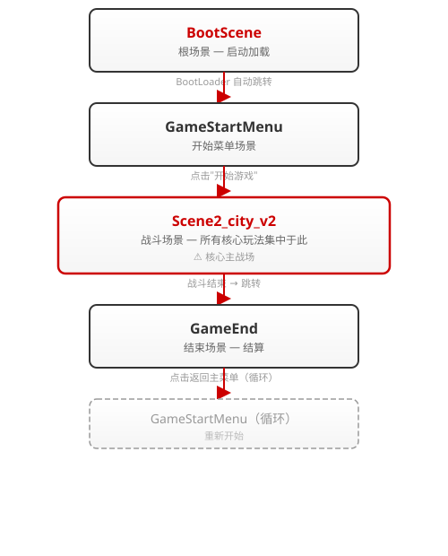
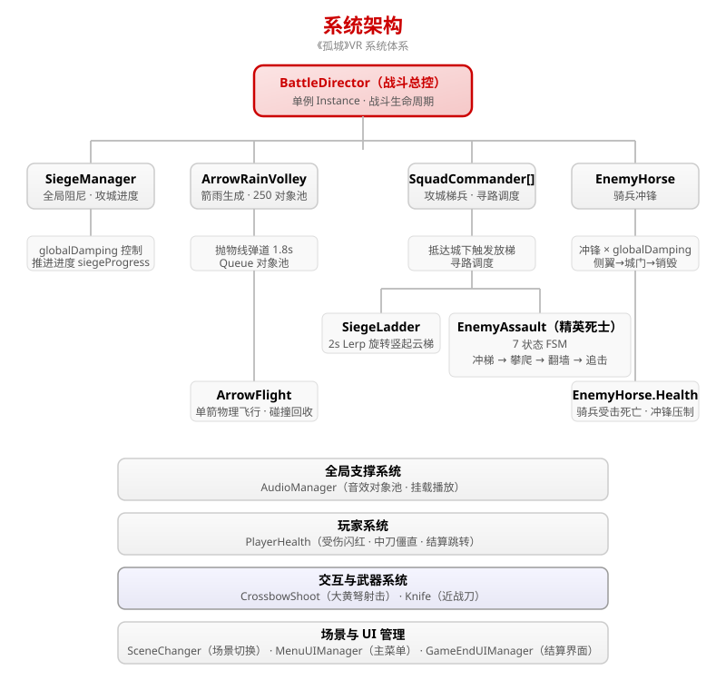
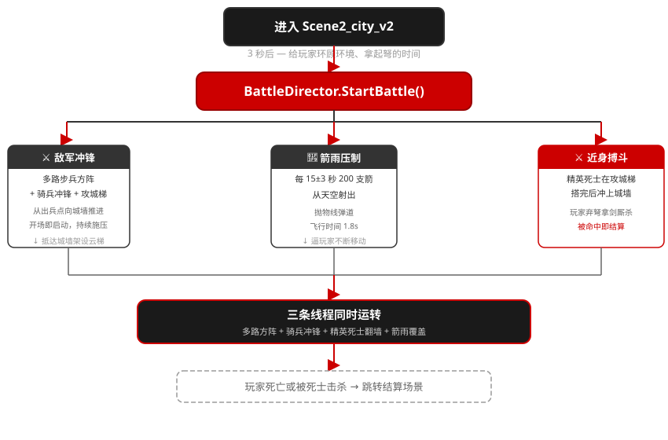
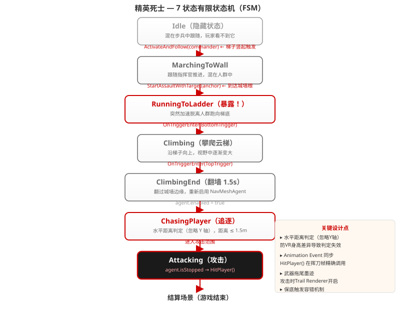
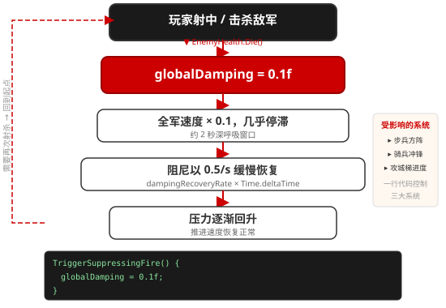

# 《孤城》(The Isolated Fortress) — 综合挑战实践课 II 期末大作业报告

**选题：基于具身交互的 VR 历史仿真体验**

> 班级：_____________  学号：_____________  姓名：_____________
> （组队：陈琦 2023212638、王新弈 2023217674）

---

## 摘要

《孤城》(The Isolated Fortress) 是一款基于 **PICO 3 (移动 VR)** 平台开发的 VR 历史仿真体验作品。项目取材自东汉耿恭疏勒城保卫战——"十三人归玉门"的历史事件，通过 **零摇杆位移、真实物理运动** 的具身交互方式，结合 **黑白红水墨视觉风格**，构建高压的攻城防御体验。项目采用 **BattleDirector** 总控架构，集成攻城梯方阵、箭雨物理系统、骑兵冲锋、精英死士有限状态机以及弩 VR 射击 + 近身搏斗等核心玩法。视觉上使用 URP 管线配合自研手写 HLSL Shader 和 Shader Graph，实现移动端高性能水墨风格渲染。项目已通过 PICO 3 真机验证，解决了 PICO SDK 3.4.0 → 3.1.0 降级兼容性问题，APK 正常运行。

**关键词**：VR 历史仿真；具身交互；水墨渲染；疏勒城；Unity；PICO

---

## 一、开发环境

### 1.1 硬件环境

| 项目 | 规格 |
|------|------|
| 开发 PC | Windows 10/11 |
| 目标 VR 设备 | PICO 3 一体机 |
| VR 交互方案 | 6DoF 空间定位 + 双手柄追踪 |

### 1.2 软件环境

| 项目 | 版本 / 名称 |
|------|-------------|
| 游戏引擎 | Unity 2022.3.62f3c1 |
| 渲染管线 | Universal Render Pipeline（URP） |
| VR 框架 | Unity XR Interaction Toolkit |
| PICO SDK | PICO Unity Integration SDK v3.1.0 |
| 编程语言 | C# |
| 3D 建模 | Blender |
| AI 寻路 | AI Navigation（NavMesh） |
| 视觉效果 | Shader Graph + HLSL Shader |
| 粒子/特效 | VFX Graph |
| 动画系统 | Unity Animator Controller + Animation Event |
| 版本控制 | Git |

### 1.3 插件依赖

- **XR Interaction Toolkit** (3.0.10) — VR 交互框架
- **AI Navigation** (1.1.7) — NavMesh 寻路系统
- **VFX Graph** (14.0.12) — 粒子特效系统
- **PICO XR SDK** (3.1.0) — PICO SDK
- **TextMeshPro** (3.0.9) — UI 文本
- **Visual Scripting** (1.9.4) — 可视化脚本
- **Polybrush** (1.1.8) — 场景网格编辑

### 1.4 环境配置方法

**Unity 编辑器设置：**
- 使用 Unity Hub 安装 Unity 2022.3.62f3c1，添加 Android Build Support 模块（含 SDK、NDK、JDK）
- 创建新项目后通过 Package Manager 导入 Universal RP、XR Interaction Toolkit、AI Navigation 等官方包
- PICO SDK 通过 Package Manager 的 "Add package from disk" 导入本地 package.json
- 将项目 Build Settings 切换为 Android 平台，Scripting Backend 选 IL2CPP，Target Architectures 勾选 ARM64
- XR Plug-in Management 中切换 Android 选项卡，勾选 PICO 作为 XR 提供程序
- Player Settings 中 Minimum API Level 设为 Android 10.0（API Level 29）
- 通过 PICO → Platform Settings 填入从 PICO 开发者平台获取的 APP ID

**真机调试设置：**
- PICO 3 开启开发者模式，通过 USB 连接电脑
- PICO 设备端允许 USB 调试授权
- Unity 中直接 Build And Run 即可部署到设备

---

## 二、运行方法

### 2.1 运行前提

1. **Unity 编辑器运行**：需安装 Unity 2022.3.62f3c1，打开项目后确保已导入以下 Package：
   - Universal RP（URP）
   - XR Interaction Toolkit
   - PICO Unity Integration SDK v3.1.0
   - AI Navigation（NavMesh）
2. **PICO 真机运行**：需将项目打包为 Android APK，安装至 PICO 3 设备。打包前确认：
   - Build Settings → Platform 切换为 Android
   - Player Settings → Minimum API Level ≥ 29
   - XR Plug-in Management → 勾选 PICO
   - APP ID 已通过 PICO 开发者平台获取并配置

### 2.2 运行流程

整个体验由 4 个场景串联：



- **BootScene**：启动加载，存放全局 Don't Destroy On Load 管理器
- **GameStartMenu**：主菜单场景，3D UI 界面让玩家进入或退出
- **Scene2_city_v2**：核心战斗场景，玩家在城墙上弩箭射击防守、与冲上城墙的敌军厮杀
- **GameEnd**：结算场景，显示历史描述，可返回主菜单重新开始

### 2.3 操作说明

- **弩射击**：扣动扳机键（Trigger）→ 箭矢从弩口飞出，命中敌人触发压制效果
- **挥刀近战**：拔刀迎击 → 死士翻墙后近身格斗，刀刃墨迹拖尾
- **躲避箭雨**：真实下蹲 / 侧移 → 被敌箭命中会屏幕闪红
- **暂停**：按下手柄 Menu 键 → 呼出暂停菜单，射线点击 UI

### 2.4 构建产物

打包后的 APK 文件可直接安装至 PICO 3 设备运行。如需在编辑器中测试，打开 `BootScene` 场景后点击 Play，场景将自动从 BootScene → GameStartMenu → Scene2_city_v2 流转。

---

## 三、设计与实现过程

### 3.1 项目架构设计

#### 3.1.1 整体架构

项目采用 **BattleDirector**（战斗导演）单例指挥架构作为核心调度中枢。场景流转链路为：BootLoader → GameStartMenu → Scene2_city_v2 → GameEnd。BootScene 存放全局 Don't Destroy On Load 管理器（AudioManager、SceneChanger 等），防止重复生成。



#### 3.1.2 核心设计理念

- **零摇杆位移**：摒弃传统 VR 摇杆移动方案，所有位移依赖玩家真实身体动作（转身、下蹲、侧移），从根本上消除 VR 眩晕
- **具身交互**：通过物理手柄追踪实现弓箭射击、挥刀格挡等操作的体感映射
- **战场压力调控**：全局阻尼系统将玩家命中率转化为生存时间的可控变量

### 3.2 PICO SDK 接入与环境配置

#### 3.2.1 注册与 SDK 导入

前往 PICO 开发者平台注册账号并获取 APP ID，在 Unity 中通过 PICO → Platform Settings 填入。下载 PICO Unity Integration SDK，在 Package Manager 中导入本地 package.json。

#### 3.2.2 XR 与项目参数配置

在 Project Settings 的 XR Plug-in Management 中切换到安卓平台选项卡，勾选 PICO。Player Settings 中 Minimum API Level 设为 Android 10.0（API Level 29），Scripting Backend 选 IL2CPP，Target Architectures 只勾选 ARM64。按 Project Validation 的要求逐项修改项目配置。

#### 3.2.3 SDK 兼容性修复

项目开发基于 PICO Unity Integration SDK v3.4.0，完成功能后打包发现 APK 在 PICO 3 上闪退。经排查确认 v3.4.0 与 Unity 2022.3.62f3c1 存在兼容性冲突，将 SDK 降级至 v3.1.0 后问题解决（详细排查过程见 4.1 节）。

### 3.3 VR 交互场景构建

#### 3.3.1 XR Origin 与手柄配置

导入 PICO SDK 和 XR Interaction Toolkit 后，在场景中创建 XR Origin 作为 VR 交互根节点。在左右手控制器上挂载 XRRayInteractor 组件，使手柄发射射线用于检测物体和 UI 元素。

#### 3.3.2 UI 交互适配

在交互 Canvas 上挂载 TrackedDeviceGraphicRaycaster 替换默认 GraphicRaycaster，使其接收 XR 射线事件。在 EventSystem 上挂载 XRUIInputModule 替换默认 StandaloneInputModule，负责将射线事件分发给 UI。

#### 3.3.3 场景串联

场景切换通过 `SceneChanger` 组件管理：

```csharp
public class SceneChanger : MonoBehaviour
{
    public void LoadGameStartMenu() => SceneManager.LoadScene("GameStartMenu");
    public void LoadCityScene() => SceneManager.LoadScene("Scene2_city_v2");
    public void LoadGameEndScene() => SceneManager.LoadScene("GameEnd");
}z
```

各场景功能分配：
- **BootLoader**：自动跳转 BootScene → GameStartMenu，存放全局管理器
- **MenuUIManager**：主菜单 UI，3D 界面提供进入/退出
- **GameEndUIManager**：结算页面，历史文字描述 + 返回主菜单
- **XRUIManager**：暂停菜单，Menu 键切换，Ray Interactor 操作

### 3.4 战斗系统实现

#### 3.4.1 BattleDirector 战斗调度

BattleDirector 在 3 秒延时后自动启动整场战斗，采用多路并行出兵机制：

```csharp
Invoke("StartBattle", 3f);
```

- 多个出兵点（`spawnPoints[]`）与目标城墙（`targetWalls[]`）一一对应
- 多线程运转：步兵方阵推进、骑兵冲锋、精英死士激活、箭雨覆盖同时进行



#### 3.4.2 敌军 AI 系统

**攻城梯方阵**：从多个出兵点同时向城墙推进，抵达后架设云梯（2 秒内从平放旋转竖起），为死士提供翻墙路径。

**骑兵冲锋**：开局由 BattleDirector 派出 100 匹从侧翼冲向城门，之后每 5 秒补充 20 匹，场上上限 150 匹。到达城门后自动销毁，死亡触发全局压制。

**精英死士（有限状态机）**：战场上唯一的特殊单位，整个战斗仅触发一次。死士初始跟随方阵推进，云梯架好后被激活，沿梯攀爬翻墙，寻路追逐玩家近身格斗。

死士采用 7 状态 FSM，关键设计点：
- **水平距离判定**：所有判定忽略 Y 轴，防止 VR 玩家身高差异导致判定失效
- **Animation Event**：`HitPlayer()` 在武器挥出帧由动画事件调用，攻击动画与伤害判定精确同步
- **武器拖尾墨迹**：攻击时开启 Trail Renderer，收刀关闭，在黑白红风格中清晰可辨
- **保底触发**：防碰撞体漏检容错——距梯子够近但 trigger 未触发时强制执行



**核心文件**：`Assets/Script/armymanage/EnemyHorse.cs`、`Assets/Script/armymanage/EnemyAssault.cs`

#### 3.4.3 核心交互玩法

**弩箭射击——远程压制**：玩家扣动扳机，箭矢从弩口生成，以 `shootForce = 2000` 的瞬时物理力射出，伴随破空音效挂载在箭矢上跟随飞行。箭矢命中敌人触发 `SiegeManager.TriggerSuppressingFire()`。

**全局阻尼系统**：连接玩家命中率与生存压力的核心纽带。每次击杀将全局阻尼 `globalDamping` 瞬间压制到 0.1（10%），然后以 0.5/s 缓慢恢复至 1.0。所有敌方单位（步兵、骑兵、攻城梯架设）的推进速度均乘以该系数——射得越准，压力越低。

```csharp
public void TriggerSuppressingFire() { globalDamping = 0.1f; }

void Update()
{
    float currentSpeed = baseAdvanceSpeed * globalDamping;
    siegeProgress += currentSpeed * Time.deltaTime;
    if (globalDamping < 1f)
        globalDamping += dampingRecoveryRate * Time.deltaTime;
}
```



**玩家受伤系统**：VR 中不显示血条以保沉浸感，采用纯体感反馈：

| 受伤来源 | 体感表现 | 操作影响 | 恢复时机 |
|---------|---------|---------|---------|
| 中箭 | 屏幕闪红（Mesh 包裹摄像机，60%→0 透明度渐变） | 箭矢挂载在玩家身上，5 秒后自动销毁 |
| 被死士攻击 | 闪红 + 武器脱手 | 无法反击 | 1.5 秒后跳转结算 |

**核心文件**：`Assets/Script/obj/CrossbowShoot.cs`、`Assets/Script/managers/SiegeManager.cs`、`Assets/Script/managers/PlayerHealth.cs`

#### 3.4.4 NavMesh 寻路系统

项目基于 AI Navigation 插件构建 NavMesh 寻路体系，为所有敌方单位提供移动寻路能力。

**寻路网格生成**：导入 AI Navigation 包后新建 Humanoid 人型类别，调整 Agent Radius（决定角色能通过的最小通道宽度）和 Step Height（可跨过的台阶高度）等参数，点击 Bake 生成寻路网格。

**NavMeshAgent 配置**：在需要寻路的单位上添加 NavMeshAgent 组件，关键参数包括 Speed（移动速度）、Acceleration（加速度）、Angular Speed（转向速度）、Stopping Distance（停止距离）。

**SetDestination 移动控制**：运行中调用 `agent.SetDestination()` 传入目标坐标，Agent 自动沿网格计算路径并逐帧向目标移动。

**各兵种寻路生命周期**：

**攻城梯（SquadCommander）**：每个出兵点生成一个 SquadCommander，携带攻城梯使用 NavMeshAgent 走向指定城墙位置。速度通过 `siegeManager.globalDamping` 动态调节，击杀敌人触发压制时拖慢推进。到达后经水平距离 + 路径完整性双重校验，确认到位后 `agent.enabled = false` 关闭寻路组件，触发架梯动画。

**骑兵冲锋**：骑兵使用 NavMeshAgent 从出兵点附近随机采样有效 NavMesh 位置后生成，设目标为城门，抵达后直接归池。

**精英死士**：NavMeshAgent 在死士的 FSM 中按需启用和禁用——跟随攻城梯前进时启用，翻墙攀爬时禁用，翻墙落地后重新启用并设目标为玩家位置进入追逐状态。落地后通过 `agent.Warp()` 自动吸附到最近 NavMesh 点，防止悬空无法寻路。

### 3.5 视觉效果实现

#### 3.5.1 水墨透明 Shader（InkCodeShader）

使用白底黑墨贴图作为输入，通过红色通道反相计算透明度——白色变为透明，黑色墨迹保留不透明。配合 Alpha 混合渲染，使城墙和房屋呈现水墨笔触的透明质感。

```hlsl
half4 frag(Varyings IN) : SV_Target
{
    half4 texColor = SAMPLE_TEXTURE2D(_MainTex, sampler_MainTex, IN.uv);
    half alpha = 1.0 - texColor.r;
    return half4(_InkColor.rgb, alpha * _InkColor.a);
}
```

使用 `Blend SrcAlpha OneMinusSrcAlpha` 标准透明度混合，关闭深度写入（`ZWrite Off`）。

#### 3.5.2 法线描边（SG_PropOutline）

通过法线向量检测模型表面转折边缘，经 Step 节点做硬边裁切后与基础颜色 Lerp 混合，为敌人、马匹、弩等可交互物体添加手绘风格黑色轮廓线，提升关键元素在水墨场景中的辨识度。

#### 3.5.3 旗帜飘动（FlagWind）

顶点动画驱动的旗帜飘动效果。通过 sin 函数计算每个顶点随时间、风速和频率的偏移，沿法线方向推动顶点产生布料飘动感。水墨旗帜版本（InkFlagWind）额外结合红色通道反相透明度，带有"漢"字样。

```hlsl
float3 worldPos = TransformObjectToWorld(IN.positionOS.xyz);
float phase = worldPos.x * _Frequency + worldPos.y * _Frequency * _Stagger;
float wave = sin(_Time.y * _WindSpeed + phase) * _Amplitude;
```

#### 3.5.4 粒子系统与积雪效果

**雪花粒子**：两套 VFX Graph 粒子系统分层叠加——大尺寸雪花全域覆盖 + 细碎小雪填充间隙，呈现大小雪花错落交织的降雪质感。

**地面积雪**：SG_Terrain 着色器通过 Snow Thickness 参数控制积雪厚度，Edge Noise 参数对雪地与裸露地面边缘做噪声扰动混合，避免生硬界线。

**城墙积雪**：inkwall 着色器的噪声扰动在垂直面上形成局部积雪、局部裸露的不均匀效果——砖墙凸起处雪量少，砖缝凹陷处和顶部边缘积雪更厚。

#### 3.5.5 材质映射

| 水墨透明类 | 描边类 | 旗帜类 |
|-----------|--------|--------|
| InkCodeShader | SG_PropOutline | FlagWind |
| 城墙、房屋 | 敌人、马、弩 | 水墨旗、布旗 |

### 3.6 音效系统实现

音频系统由 AudioManager 统一调度，底层采用 **8 通道挂载音效池**实现空间音频：预生成 8 个 AudioSource 存入队列，播放时取出一个挂载到目标 Transform 上随目标运动，播放完毕由协程自动归还。

- **战斗音效**：敌方弓弦绷紧、箭矢离弦、命中城墙的完整音效链。箭矢破空声通过 `PlayAttached("Arrow", arrowTransform)` 挂载，`spatialBlend = 0.6` 提供空间定位感
- **音调随机化**：每个 AudioSource 的 pitch 在 0.9~1.1 间随机，避免大量箭矢同时发射时产生机械重复听感
- **叙事音效**：开局敌方进攻号角（两种调性交替）→ 城墙擂鼓持续循环，从听觉上感知战局升级

**核心文件**：`Assets/Script/managers/AudioManager.cs`

### 3.7 性能优化

针对 PICO 3 移动端（高通骁龙 XR2 平台）的性能瓶颈，从对象池、寻路开销、渲染负载等维度进行针对性优化。

#### 3.7.1 箭雨对象池

箭雨每波 100 支箭，若不管理每波触发 Instantiate/Destroy 会产生大量 GC。项目采用 Unity 内置的 `UnityEngine.Pool.ObjectPool<GameObject>` 实现箭矢对象池：

```csharp
using UnityEngine.Pool;

private IObjectPool<GameObject> arrowPool;

void Awake()
{
    arrowPool = new ObjectPool<GameObject>(
        createFunc: () =>
        {
            GameObject arrow = Instantiate(enemyArrowPrefab);
            ArrowFlight flightScript = arrow.GetComponent<ArrowFlight>();
            if (flightScript != null) flightScript.myPool = this;
            return arrow;
        },
        actionOnGet: arrow => arrow.SetActive(true),
        actionOnRelease: arrow => arrow.SetActive(false),
        actionOnDestroy: arrow => Destroy(arrow),
        collectionCheck: true,
        defaultCapacity: poolSize,
        maxSize: poolSize
    );

    // 预热：全部取出再放回，避免运行时触发扩容
    GameObject[] buffer = new GameObject[poolSize];
    for (int i = 0; i < poolSize; i++) buffer[i] = arrowPool.Get();
    for (int i = 0; i < poolSize; i++) arrowPool.Release(buffer[i]);
}
```

- createFunc：首次创建时 Instantiate 预制体，挂载 ArrowFlight 脚本引用池实例
- actionOnGet：从池取出时 SetActive(true)
- actionOnRelease：释放回池时 SetActive(false)，对象存入队列复用
- maxSize 设为 poolSize（场景配置 400），超出上限的 Get 会直接返回新实例但不回收超量部分
- 预热机制：Awake 中全量 Get 再 Release，触发 ObjectPool 内部预分配，确保运行时 Get 零分配

发射时 `GetArrowFromPool()` → `arrowPool.Get()`，箭矢命中后 `ReturnArrowToPool()` → `arrowPool.Release()`，全过程避免运行时 GC 触发。

弹道计算采用运动学反向求解——固定飞行时间 1.8 秒，从起点到落点反向解算初速度向量：

```csharp
Vector3 CalculateLaunchVelocity(Vector3 start, Vector3 target, float time)
{
    Vector3 distance = target - start;
    Vector3 distanceXZ = distance; distanceXZ.y = 0;
    float velocityXZ = distanceXZ.magnitude / time;
    float velocityY = (distance.y - 0.5f * Physics.gravity.y * time * time) / time;
    Vector3 result = distanceXZ.normalized * velocityXZ;
    result.y = velocityY;
    return result;
}
```

弹道参数：
- 每波 100 支箭，`spawnInterval = 0.03f` 间隔依次发射
- 落点采样：`skyCloudBox` 范围内随机坐标 → 向下 Raycast 检测 `wallLayer` 确定命中点
- 发射起点：`sourceFiringArea`（BoxCollider）范围内随机采样
- 箭矢命中敌人后回调 `SiegeManager.TriggerSuppressingFire()` 触发全局压制

**核心文件**：`Assets/Script/armymanage/ArrowRainVolley.cs`

#### 3.7.2 骑兵对象池

骑兵同样使用 `UnityEngine.Pool.ObjectPool<GameObject>` 管理，替代原有的 Instantiate/Destroy。

**池的初始化（BattleDirector）：**

```csharp
using UnityEngine.Pool;

private IObjectPool<GameObject> horsePool;

void PrewarmHorsePool()
{
    horsePool = new ObjectPool<GameObject>(
        createFunc: () => Instantiate(horsePrefab),
        actionOnGet: OnHorseGet,
        actionOnRelease: OnHorseRelease,
        actionOnDestroy: h => Destroy(h),
        collectionCheck: true,
        defaultCapacity: horsePoolSize,
        maxSize: horsePoolSize
    );

    // 预热 horsePoolSize 匹
    GameObject[] buffer = new GameObject[horsePoolSize];
    for (int i = 0; i < horsePoolSize; i++) buffer[i] = horsePool.Get();
    for (int i = 0; i < horsePoolSize; i++) horsePool.Release(buffer[i]);
}
```

**马匹生命周期回调：**

| 回调 | 触发时机 | 操作 |
|------|---------|------|
| `OnHorseGet` | 从池取出时 | SetActive(true) + 调用 `EnemyHorse.OnSpawn()` 重置死亡标记、启用 NavMeshAgent、恢复速度参数 |
| `OnHorseRelease` | 归池时 | 调用 `EnemyHorse.ResetState()` 重置状态、SetActive(false)、设回父级 |
| `ReturnHorse` | 外部调用 | `horsePool.Release()` + 减少骑兵计数 |

**EnemyHorse 状态管理：**

- **`OnSpawn()`**：重置 `isDead = false`、`isPooled = false`，重新启用 agent 和 MicroMotion 组件，恢复冲锋速度参数
- **`ResetState()`**：`CancelInvoke()` 取消所有挂起调用，禁用 agent，重置 animator trigger
- **`ReturnToPool()`**：替代 `Destroy()`，调用 `BattleDirector.ReturnHorse()` 归池。抵达城门和被箭射中后均走此路径
- 池外销毁兜底：`OnDestroy()` 中检查 `isPooled` 标记，非池销毁时手动 `UnregisterHorse()` 减少计数

骑兵参数：
• 开局第一波派出 100 匹从侧翼冲向城门
• 之后每 5 秒补充 20 匹，场上同时存在的骑兵上限为 150 匹
• 第一波补充延迟 12 秒，给初始骑兵足够的冲锋窗口
• 对象池预分配 150 个实例（等于场上上限），确保运行时无需 Instantiate
• 骑兵使用 NavMeshAgent 从出兵点沿导航网格冲向城门，抵达后自动归池

**核心文件**：`Assets/Script/managers/BattleDirector.cs`、`Assets/Script/armymanage/EnemyHorse.cs`


---

## 四、测试

### 4.1 PICO SDK 兼容性排查与验证

项目基于 PICO Unity Integration SDK v3.4.0 开发完成全部功能后，构建 Release APK 安装到 PICO 3 真机时出现问题：APK 安装成功、图标正常显示，但点击图标后黑屏约 2 秒后退回桌面，无错误日志。

**逐层排查过程：**

1. **检查配置**：逐一核对 PXR_ProjectSetting 各项参数（立体渲染模式、注视点渲染、Controller 类型等），确认均参照文档设置
2. **启用调试输出**：关闭 Managed Stripping Level，构建 Debug APK 并通过 logcat 抓取日志——闪退前无 Unity 报错信息，无 crash 堆栈，排除代码层面异常
3. **升级系统固件**：将 PICO 3 系统固件升级至最新版本——闪退依旧，排除设备系统兼容问题
4. **空场景隔离测试**：新建空白场景，仅保留 XR Origin + PICO SDK，打包测试——**空场景同样闪退**，排除项目自身 25+ 脚本、Shader、预制体的业务逻辑冲突
5. **对比可运行项目**：对比此前其他课程可正常运行的 VR 项目，发现其使用 PICO SDK **v3.1.0** 而非 v3.4.0——怀疑 SDK 版本本身与当前 Unity 版本不兼容
6. **降级验证**：将 SDK 从 v3.4.0 降级至 v3.1.0，重新打包空场景——APK 正常运行，头显画面正常显示，确认 v3.4.0 与 Unity 2022.3.62f3c1 存在兼容性冲突
7. **全功能回归**：将整个战斗场景迁移至 v3.1.0 环境，所有战斗系统、Shader 特效、音效功能通过验证

**结论**：SDK v3.4.0 与 Unity 2022.3.62f3c1 存在底层兼容性冲突，降级至 v3.1.0 后完全解决。真机验证 APK 可正常运行。

### 4.2 性能优化验证

优化措施（详见 3.7.1~3.7.2 节）在真机上验证通过：

箭雨对象池预生成了 400 支箭，热身完成后运行时仅做 Get/Release 操作，每波 100 支箭全程无 Instantiate 触发，无 GC 分配。骑兵对象池维持 150 匹的预分配池，通过 OnSpawn/ResetState 状态生命周期管理替代了 Destroy，场上活跃数量受 maxHorsesOnField = 150 约束，不会因密集生成出现无节制 Instantiate。NavMesh 按需禁用策略（详见 3.4.4 节）同样经过验证——步兵到站后禁用 Agent、死士攀爬时关闭寻路，从 CPU 侧减少了导航网格更新频率。自研 Shader 去掉了阴影、反射、法线贴图等移动端冗余计算，FFR 进一步削减了边缘像素着色负载，整体渲染在 PICO 3 上保持流畅。

---

## 五、团队成员贡献度

| 成员 | 学号 | 贡献度 | 主要工作 |
|------|------|--------|---------|
| 陈琦 | 2023212638 | 60% | 主场景主要流程策划与制作，建模骨骼绑定，美术效果（Shader、贴图）制作，战斗系统核心脚本实现 |
| 王新弈 | 2023217674 | 40% | 音效等模块制作，全流程策划与打通，开始/结束场景制作，PICO 设备工程打包，测试调整各 Bug |

---

> **孤城不孤，魂归玉门**
